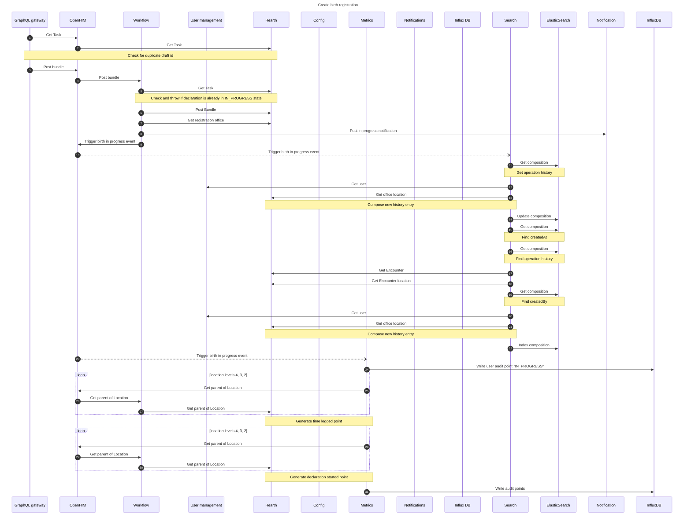

# Create birth registration (field agent)

```mermaid
---
title: Create birth registration
---

sequenceDiagram
    autonumber
    participant GraphQL gateway
    participant OpenHIM
    participant Workflow
    participant User management
    participant Hearth
    participant Config
    participant Metrics
    participant Notifications
    participant Influx DB
    participant Search
    participant ElasticSearch

    GraphQL gateway->>OpenHIM: Get Task
    OpenHIM->>Hearth: Get Task
    Note over GraphQL gateway,Hearth: Check for duplicate draft id
    GraphQL gateway->>OpenHIM: Post bundle
    OpenHIM->>Workflow: Post bundle

    %% BIRTH_IN_PROGRESS_DEC
    %% createRegistrationHandler
    %% modifyRegistrationBundle
    %% setupRegistrationWorkflow
    %% checkForDuplicateStatusUpdate
    %% fetchExistingRegStatusCode
    Workflow->>Hearth: Get Task
    Note over Workflow,Hearth: Check and throw if declaration is already in IN_PROGRESS state
    Workflow->>Hearth: Post Bundle
    Workflow->>Hearth: Get registration office
    Workflow->>Notification: Post in progress notification
    Workflow->>OpenHIM: Trigger birth in progress event

    OpenHIM--)Search: Trigger birth in progress event

    %% upsertEvent
    %% updateEvent
    Search->>ElasticSearch: Get composition
    Note over Search,ElasticSearch: Get operation history
    %% createStatusHistory
    Search->>User management: Get user
    Search->>Hearth: Get office location
    Note over Search,Hearth: Compose new history entry
    %% updateComposition
    Search->>ElasticSearch: Update composition

    %% indexAndSearchComposition
    Search->>ElasticSearch: Get composition
    Note over Search,ElasticSearch: Find createdAt
    Search->>ElasticSearch: Get composition
    Note over Search,ElasticSearch: Find operation history

    %% createIndexBody
      %% createChildIndex
      %% addEventLocation
    Search->>Hearth: Get Encounter
    Search->>Hearth: Get Encounter location

      %% createDeclarationIndex
      %% getCreatedBy
    Search->>ElasticSearch: Get composition
    Note over Search,ElasticSearch: Find createdBy

      %% createStatusHistory
    Search->>User management: Get user
    Search->>Hearth: Get office location
    Note over Search,Hearth: Compose new history entry

    %% indexComposition
    Search->>ElasticSearch: Index composition

    %% Duplicates don't get detected, as the status is IN_PROGRESS

    OpenHIM--)Metrics: Trigger birth in progress event
    Metrics->>InfluxDB: Write user audit point "IN_PROGRESS"

    loop location levels 4, 3, 2
        Metrics->>OpenHIM: Get parent of Location
        OpenHIM->>Workflow: Get parent of Location
        Workflow->>Hearth: Get parent of Location
    end
    Note over Metrics,Hearth: Generate time logged point

    loop location levels 4, 3, 2
        Metrics->>OpenHIM: Get parent of Location
        OpenHIM->>Workflow: Get parent of Location
        Workflow->>Hearth: Get parent of Location
    end
    Note over Metrics,Hearth: Generate declaration started point
    Metrics->>InfluxDB: Write audit points
```
