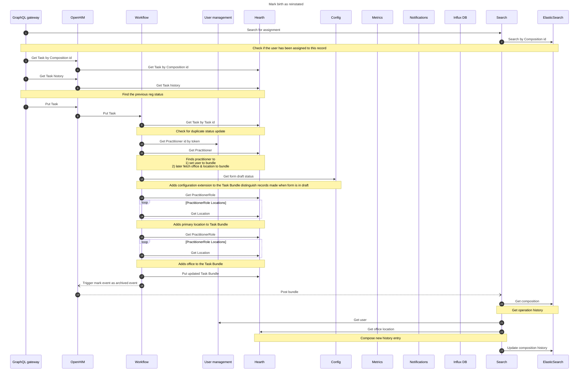

# Mark birth as reinstated

```mermaid
---
title: Mark birth as reinstated
---

sequenceDiagram
    autonumber
    participant GraphQL gateway
    participant OpenHIM
    participant Workflow
    participant User management
    participant Hearth
    participant Config
    participant Metrics
    participant Notifications
    participant Influx DB
    participant Search
    participant ElasticSearch

    GraphQL gateway->>Search: Search for assignment
    Search->>ElasticSearch: Search by Composition id
    Note over GraphQL gateway,ElasticSearch: Check if the user has been assigned to this record
    GraphQL gateway->>OpenHIM: Get Task by Composition id
    OpenHIM->>Hearth: Get Task by Composition id
    GraphQL gateway->>OpenHIM: Get Task history
    OpenHIM->>Hearth: Get Task history
    Note over GraphQL gateway, Hearth: Find the previous reg status
    GraphQL gateway->>OpenHIM: Put Task
    OpenHIM->>Workflow: Put Task

    Workflow->>Hearth: Get Task by Task id
    Note over Workflow,Hearth: Check for duplicate status update

    Workflow->>User management: Get Practitioner id by token
    Workflow->>Hearth: Get Practitioner
    Note over Workflow,Hearth: Finds practitioner to<br />1) set user to bundle<br />2) later fetch office & location to bundle
    Workflow->>Config: Get form draft status
    Note over Workflow,Config: Adds configuration extension to the Task Bundle distinguish records made when form is in draft
    Workflow->>Hearth: Get PractitionerRole
    loop PractitionerRole Locations
        Workflow->>Hearth: Get Location
    end
    Note over Workflow,Hearth: Adds primary location to Task Bundle
    Workflow->>Hearth: Get PractitionerRole
    loop PractitionerRole Locations
        Workflow->>Hearth: Get Location
    end
    Note over Workflow,Hearth: Adds office to the Task Bundle
    Workflow->>Hearth: Put updated Task Bundle
    Workflow--)OpenHIM: Trigger mark event as archived event
    OpenHIM--)Search: Post bundle
    Search->>ElasticSearch: Get composition
    Note over Search,ElasticSearch: Get operation history
    Search->>User management: Get user
    Search->>Hearth: Get office location
    Note over Search,Hearth: Compose new history entry
    Search->>ElasticSearch: Update composition history
```
