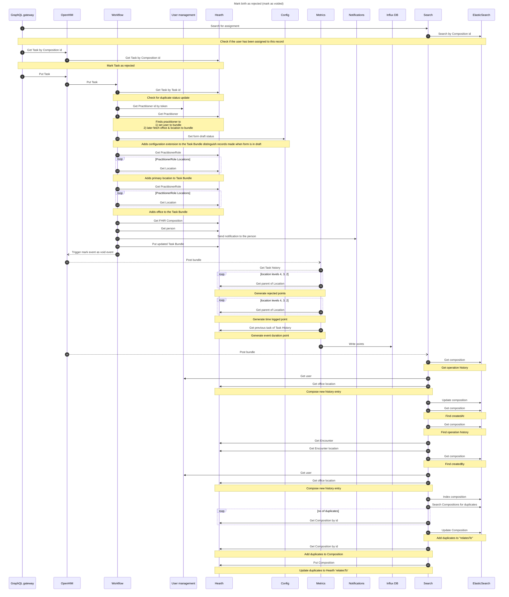

# Mark birth as void

```mermaid
---
title: Mark birth as rejected (mark as voided)
---

sequenceDiagram
    autonumber
    participant GraphQL gateway
    participant OpenHIM
    participant Workflow
    participant User management
    participant Hearth
    participant Config
    participant Metrics
    participant Notifications
    participant Influx DB
    participant Search
    participant ElasticSearch

    GraphQL gateway->>Search: Search for assignment
    Search->>ElasticSearch: Search by Composition id
    Note over GraphQL gateway,ElasticSearch: Check if the user has been assigned to this record
    GraphQL gateway->>OpenHIM: Get Task by Composition id
    OpenHIM->>Hearth: Get Task by Composition id
    Note over GraphQL gateway,Hearth: Mark Task as rejected
    GraphQL gateway->>OpenHIM: Put Task
    OpenHIM->>Workflow: Put Task
    Workflow->>Hearth: Get Task by Task id
    Note over Workflow,Hearth: Check for duplicate status update

    Workflow->>User management: Get Practitioner id by token
    Workflow->>Hearth: Get Practitioner
    Note over Workflow,Hearth: Finds practitioner to<br />1) set user to bundle<br />2) later fetch office & location to bundle

    Workflow->>Config: Get form draft status
    Note over Workflow,Config: Adds configuration extension to the Task Bundle distinguish records made when form is in draft

    Workflow->>Hearth: Get PractitionerRole
    loop PractitionerRole Locations
        Workflow->>Hearth: Get Location
    end
    Note over Workflow,Hearth: Adds primary location to Task Bundle
    Workflow->>Hearth: Get PractitionerRole
    loop PractitionerRole Locations
        Workflow->>Hearth: Get Location
    end
    Note over Workflow,Hearth: Adds office to the Task Bundle

    Workflow->>Hearth: Get FHIR Composition
    Workflow->>Hearth: Get person
    Workflow->>Notifications: Send notification to the person
    Workflow->>Hearth: Put updated Task Bundle
    Workflow--)OpenHIM: Trigger mark event as void event


    OpenHIM--)Metrics: Post bundle
    Metrics-->Hearth: Get Task history

    loop location levels 4, 3, 2
        Metrics->>Hearth: Get parent of Location
    end
    Note over Metrics,Hearth: Generate rejected points

    loop location levels 4, 3, 2
        Metrics->>Hearth: Get parent of Location
    end
    Note over Metrics,Hearth: Generate time logged point

    Metrics->>Hearth: Get previous task of Task History
    Note over Metrics,Hearth: Generate event duration point
    Metrics->>Influx DB: Write points
    OpenHIM--)Search: Post bundle

    %% upsertEvent
    %% updateEvent
    Search->>ElasticSearch: Get composition
    Note over Search,ElasticSearch: Get operation history
    %% createStatusHistory
    Search->>User management: Get user
    Search->>Hearth: Get office location
    Note over Search,Hearth: Compose new history entry
    %% updateComposition
    Search->>ElasticSearch: Update composition

    %% indexAndSearchComposition
    Search->>ElasticSearch: Get composition
    Note over Search,ElasticSearch: Find createdAt
    Search->>ElasticSearch: Get composition
    Note over Search,ElasticSearch: Find operation history

    %% createIndexBody
      %% createChildIndex
      %% addEventLocation
    Search->>Hearth: Get Encounter
    Search->>Hearth: Get Encounter location

      %% createDeclarationIndex
      %% getCreatedBy
    Search->>ElasticSearch: Get composition
    Note over Search,ElasticSearch: Find createdBy

      %% createStatusHistory
    Search->>User management: Get user
    Search->>Hearth: Get office location
    Note over Search,Hearth: Compose new history entry

    %% indexComposition
    Search->>ElasticSearch: Index composition

    %% detectAndUpdateduplicates
      %% detectDuplicates
        %% searchComposition
    Search->>ElasticSearch: Search Compositions for duplicates
      %% updateCompositionWithDuplicates

    loop no of duplicates
        Search->>Hearth: Get Composition by id
    end

    Search->>ElasticSearch: Update Composition
    Note over Search,ElasticSearch: Add duplicates to "relatesTo"

    Search->>Hearth: Get Composition by id
    Note over Search,Hearth: Add duplicates to Composition

    Search->>Hearth: Put Composition
    Note over Search,Hearth: Update duplicates to Hearth 'relatesTo'
```
