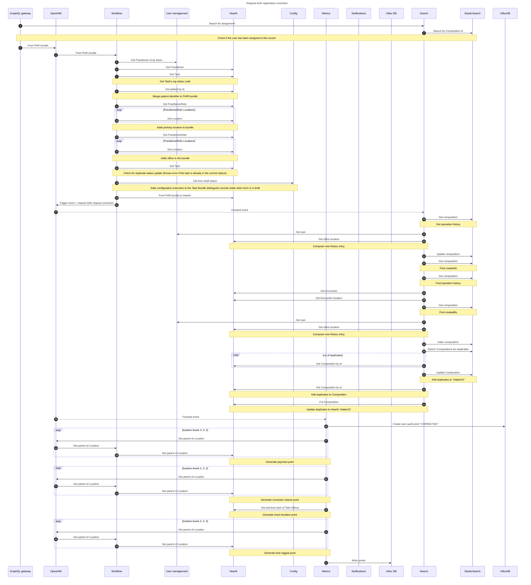

# Request birth registration correction

```mermaid
---
title: Request birth registration correction
---

sequenceDiagram
    autonumber
    participant GraphQL gateway
    participant OpenHIM
    participant Workflow
    participant User management
    participant Hearth
    participant Config
    participant Metrics
    participant Notifications
    participant Influx DB
    participant Search
    participant ElasticSearch

    GraphQL gateway->>Search: Search for assignment
    Search->>ElasticSearch: Search by Composition id
    Note over GraphQL gateway,ElasticSearch: Check if the user has been assigned to this record
    GraphQL gateway->>OpenHIM: Post FHIR bundle
    OpenHIM->>Workflow: Post FHIR bundle
    Workflow->>User management: Get Practitioner id by token
    Workflow->>Hearth: Get Practitioner
    Workflow->>Hearth: Get Task
    Note over Workflow,Hearth: Get Task's reg status code
    Workflow->>Hearth: Get patient by id
    Note over Workflow,Hearth: Merge patient identifier to FHIR bundle

    Workflow->>Hearth: Get PractitionerRole
    loop PractitionerRole Locations
        Workflow->>Hearth: Get Location
    end
    Note over Workflow,Hearth: Adds primary location to bundle

    Workflow->>Hearth: Get PractitionerRole
    loop PractitionerRole Locations
        Workflow->>Hearth: Get Location
    end
    Note over Workflow,Hearth: Adds office to the bundle

    Workflow->>Hearth: Get Task
    Note over Workflow,Hearth: Check for duplicate status update (throws error if the task is already in the current status!)

    Workflow->>Config: Get form draft status
    Note over Workflow,Config: Adds configuration extension to the Task Bundle distinguish records made when form is in draft

    Workflow->>Hearth: Post FHIR bundle to Hearth
    Workflow->>OpenHIM: Trigger event = request birth request correction

    OpenHIM--)Search: Forward event

    %% upsertEvent
    %% updateEvent
    Search->>ElasticSearch: Get composition
    Note over Search,ElasticSearch: Get operation history
    %% createStatusHistory
    Search->>User management: Get user
    Search->>Hearth: Get office location
    Note over Search,Hearth: Compose new history entry
    %% updateComposition
    Search->>ElasticSearch: Update composition

    %% indexAndSearchComposition
    Search->>ElasticSearch: Get composition
    Note over Search,ElasticSearch: Find createdAt
    Search->>ElasticSearch: Get composition
    Note over Search,ElasticSearch: Find operation history

    %% createIndexBody
      %% createChildIndex
      %% addEventLocation
    Search->>Hearth: Get Encounter
    Search->>Hearth: Get Encounter location

      %% createDeclarationIndex
      %% getCreatedBy
    Search->>ElasticSearch: Get composition
    Note over Search,ElasticSearch: Find createdBy

      %% createStatusHistory
    Search->>User management: Get user
    Search->>Hearth: Get office location
    Note over Search,Hearth: Compose new history entry

    %% indexComposition
    Search->>ElasticSearch: Index composition

    %% detectAndUpdateduplicates
      %% detectDuplicates
        %% searchComposition
    Search->>ElasticSearch: Search Compositions for duplicates
      %% updateCompositionWithDuplicates

    loop no of duplicates
        Search->>Hearth: Get Composition by id
    end

    Search->>ElasticSearch: Update Composition
    Note over Search,ElasticSearch: Add duplicates to "relatesTo"

    Search->>Hearth: Get Composition by id
    Note over Search,Hearth: Add duplicates to Composition

    Search->>Hearth: Put Composition
    Note over Search,Hearth: Update duplicates to Hearth 'relatesTo'

    OpenHIM--)Metrics: Forward event
    Metrics->>InfluxDB: Create user audit point "CORRECTED"

    loop location levels 4, 3, 2
        Metrics->>OpenHIM: Get parent of Location
        OpenHIM->>Workflow: Get parent of Location
        Workflow->>Hearth: Get parent of Location
    end
    Note over Metrics,Hearth: Generate payment point

    loop location levels 4, 3, 2
        Metrics->>OpenHIM: Get parent of Location
        OpenHIM->>Workflow: Get parent of Location
        Workflow->>Hearth: Get parent of Location
    end
    Note over Metrics,Hearth: Generate correction reason point

    Metrics->>Hearth: Get previous task of Task History
    Note over Metrics,Hearth: Generate event duration point

    loop location levels 4, 3, 2
        Metrics->>OpenHIM: Get parent of Location
        OpenHIM->>Workflow: Get parent of Location
        Workflow->>Hearth: Get parent of Location
    end
    Note over Metrics,Hearth: Generate time logged point
    Metrics->>Influx DB: Write points
```
