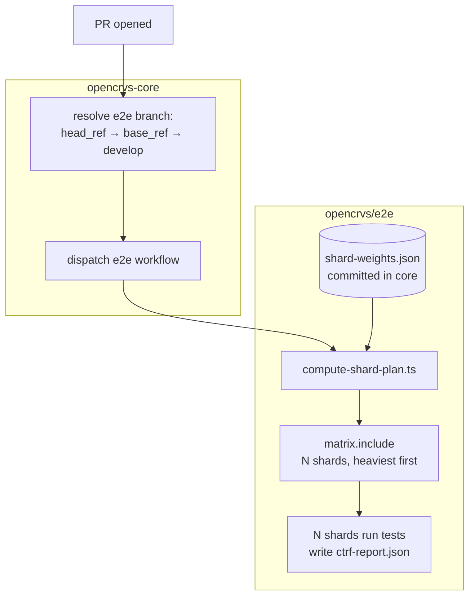

# How E2E CI sharding works

`compute-shard-plan.ts` bin-packs spec files across shards by estimated duration (`shard-weights.json`), instead of Playwright's own `--shard`, which splits alphabetically by file count. The `plan` job in [opencrvs/e2e](https://github.com/opencrvs/e2e)'s `deploy-and-e2e.yml` runs it and feeds the result into a dynamic `matrix.include`.

Shard count (`--shards=N` in the `plan` job) and `max-parallel` are independent knobs — if `max-parallel` is set, keep it equal to the shard count so no shard sits queued behind a full batch. Currently the `test` job has no `max-parallel` cap, so all 30 shards run concurrently. Fewer/more concurrent shards is a real tradeoff, not just a speed dial: every shard hits the same shared deployed test environment, so more concurrency means more backend load.

## Keeping shard-weights.json fresh

A separate workflow, [`refresh-shard-weights.yml`](https://github.com/opencrvs/e2e/blob/develop/.github/workflows/refresh-shard-weights.yml), runs on a biweekly cron (and can be triggered manually). It downloads ctrf reports from the latest successful e2e run on `develop`, runs `aggregate-shard-weights.ts` to sum per-file durations, regenerates `shard-weights.json`, opens a PR against core, and pings Slack for review — no auto-commits, no cache, a human always merges it.
