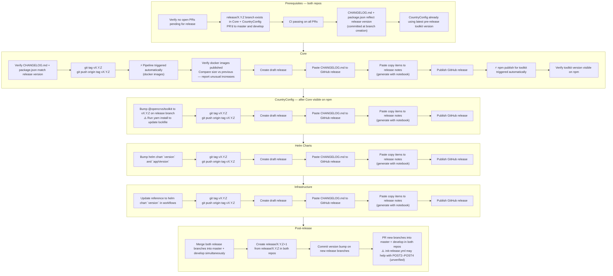

# Technical Releasing

## Links

- Copy items notebook: https://gist.github.com/rikukissa/9415b88016c0acfc0e0d4e00add45993
- init-release workflow: https://github.com/opencrvs/opencrvs-core/actions/workflows/init-release.yml
