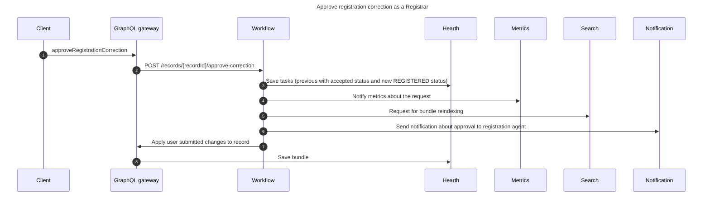

## Request approval flow

```mermaid
---
title: Approve registration correction as a Registrar
---
sequenceDiagram
    autonumber
    Client->>GraphQL gateway: approveRegistrationCorrection
    GraphQL gateway->>Workflow: POST /records/{recordId}/approve-correction
    Workflow->>Hearth: Save tasks (previous with accepted status and new REGISTERED status)
    Workflow->>Metrics: Notify metrics about the request
    Workflow->>Search: Request for bundle reindexing
    Workflow->>Notification: Send notification about approval to registration agent
    Workflow->>GraphQL gateway: Apply user submitted changes to record
    GraphQL gateway->>Hearth: Save bundle
```
