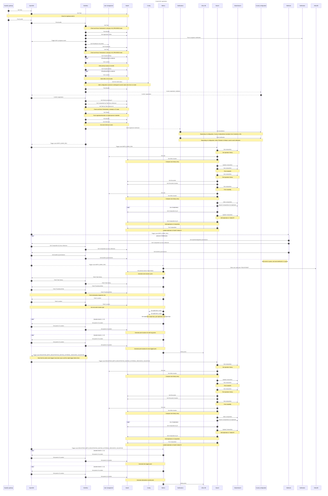

# Create birth registration (registrar)

```mermaid
---
title: Create birth registration
---

sequenceDiagram

    autonumber
    participant GraphQL gateway
    participant OpenHIM
    participant Workflow
    participant User management
    participant Hearth
    participant Config
    participant Metrics
    participant Notifications
    participant Influx DB
    participant Search
    participant ElasticSearch
    participant Country configuration
    participant Webhook

    GraphQL gateway->>OpenHIM: Get Task
    OpenHIM->>Hearth: Get Task
    Note over GraphQL gateway,Hearth: Check for duplicate draft id
    GraphQL gateway->>OpenHIM: Post bundle
    OpenHIM->>Workflow: Post bundle

    %% REGISTRAR_BIRTH_REGISTRATION_WAITING_EXTERNAL_RESOURCE_VALIDATION
    %% createRegistrationHandler
      %% modifyRegistrationBundle
      %% setupRegistrationWorkflow
      %% checkForDuplicateStatusUpdate
      %% fetchExistingRegStatusCode
    Workflow->>Hearth: Get Task
    Note over Workflow,Hearth: Check and throw if declaration is already in IN_PROGRESS state
    Workflow->>Hearth: Post Bundle
    Workflow->>Hearth: Get registration office
    Workflow->>Notification: Post in progress notification
    Workflow->>OpenHIM: Trigger birth in progress event

    %% markBundleAsWaitingValidation
      %% getLoggedInPractitionerResource
    Workflow->>User management: Get Practitioner id by token
    Workflow->>Hearth: Get Practitioner

      %% setupRegistrationWorkflow
    Workflow->>Hearth: Get Task
    Note over Workflow,Hearth: Check and throw if declaration is already in IN_PROGRESS state

      %% setupLastRegLocation
    Workflow->>Hearth: Get PractitionerRole
    loop PractitionerRole Locations
        Workflow->>Hearth: Get Location
    end
    Note over Workflow,Hearth: Adds primary location to bundle

    Workflow->>Hearth: Get PractitionerRole
    loop PractitionerRole Locations
        Workflow->>Hearth: Get Location
    end
    Note over Workflow,Hearth: Adds office to the bundle

    Workflow->>Config: Get form draft status
    Note over Workflow,Config: Adds configuration extension to distinguish records made when form is in draft

    Workflow->>Hearth: Post Bundle

    %% invokeRegistrationValidation
    Workflow--)Country configuration: Invoke registration validation

    %% createWebHookResponseFromBundle
    Country configuration--)OpenHIM: Confirm registration
    OpenHIM->>Workflow: Confirm registration

    %% markEventAsRegisteredCallbackHandler
    Workflow->>Hearth: Get Task by tracking id
    Workflow->>Hearth: Get Composition by Task focus reference
      %% markEventAsRegistered
        %% setupRegistrationWorkflow
    Workflow->>Hearth: Get Task by Task resource id
    Note over Workflow,Hearth: Check and throw if declaration is already in (?) state

      %% updatePatientIdentifierWithRN
    Workflow->>Hearth: Get Patient
    Note over Workflow,Hearth: Push registrationNumber on related person's identifier

    %% ---------------------------------------
    %% NOTE: If DEATH validateDeceasedDetails!
    %% ---------------------------------------

    Workflow->>Hearth: Post Bundle

    %% getEventInformantName
    Workflow->>Hearth: Get Informant
    Note over Workflow,Hearth: Get event informant name

    %% sendRegisteredNotification
    Workflow--)Notifications: Send registered notification

    %% sendBirthRegistrationConfirmation
    Notifications->>Country configuration: Get translations
    Note over Notifications,Country configuration: Depending on configuration, Country Config fetches translation from Contentful or file
    Notifications->>Country configuration: Send notification
    Note over Notifications,Country configuration: Depending on configuration, either Clickatel or Infobip is used to send notification

    Workflow--)OpenHIM: Trigger event BIRTH_MARK_REG
    OpenHIM->>Search: Trigger event BIRTH_MARK_REG

    %% upsertEvent
    %% updateEvent
    Search->>ElasticSearch: Get composition
    Note over Search,ElasticSearch: Get operation history
    %% createStatusHistory
    Search->>User management: Get user
    Search->>Hearth: Get office location
    Note over Search,Hearth: Compose new history entry
    %% updateComposition
    Search->>ElasticSearch: Update composition

    %% indexAndSearchComposition
    Search->>ElasticSearch: Get composition
    Note over Search,ElasticSearch: Find createdAt
    Search->>ElasticSearch: Get composition
    Note over Search,ElasticSearch: Find operation history

    %% createIndexBody
      %% createChildIndex
      %% addEventLocation
    Search->>Hearth: Get Encounter
    Search->>Hearth: Get Encounter location

      %% createDeclarationIndex
      %% getCreatedBy
    Search->>ElasticSearch: Get composition
    Note over Search,ElasticSearch: Find createdBy

      %% createStatusHistory
    Search->>User management: Get user
    Search->>Hearth: Get office location
    Note over Search,Hearth: Compose new history entry

    %% indexComposition
    Search->>ElasticSearch: Index composition

    %% detectAndUpdateduplicates
      %% detectDuplicates
        %% searchComposition
    Search->>ElasticSearch: Search Compositions for duplicates
      %% updateCompositionWithDuplicates

    loop no of duplicates
        Search->>Hearth: Get Composition by id
    end

    Search->>ElasticSearch: Update Composition
    Note over Search,ElasticSearch: Add duplicates to "relatesTo"

    Search->>Hearth: Get Composition by id
    Note over Search,Hearth: Add duplicates to Composition

    Search->>Hearth: Put Composition
    Note over Search,Hearth: Update duplicates to Hearth 'relatesTo'

    %%%

    OpenHIM--)Webhook: Trigger event BIRTH_MARK_REG
    loop amount of Webhooks
        Webhook->>User management: Get System(Integration) permissions
        Webhook->>OpenHIM: Get Composition by focus reference
        OpenHIM->>Workflow: Get Composition by focus reference
        Workflow->>Hearth: Get Composition by focus reference

        Webhook->>OpenHIM: Get bundle by permissions
        OpenHIM->>Workflow: Get bundle by permissions
        Workflow->>Hearth: Get bundle by permissions
    end
    Note left of Webhook: Add events to queue, and send webhooks in a queue

    OpenHIM--)Metrics: Trigger event BIRTH_MARK_REG
    %% markBirthRegisteredHandler
    Metrics->>InfluxDB: Write user audit point "REGISTERED"
    Metrics->>Hearth: Get previous task of Task History
    Note over Metrics,Hearth: Generate event duration point

    %% generateBirthRegPoint
      %% fetchDeclarationsBeginnerRole
        %% fetchTaskHistory
    Metrics->>OpenHIM: Fetch Task history
    OpenHIM->>Workflow: Fetch Task history
    Workflow->>Hearth: Fetch Task history

    Metrics->>OpenHIM: Fetch PractitionerRole
    OpenHIM->>Workflow: Fetch PractitionerRole
    Workflow->>Hearth: Fetch PractitionerRole
    Note over OpenHIM,Metrics: Fetch declarations beginners role

    Metrics->>OpenHIM: Fetch Location
    OpenHIM->>Workflow: Fetch Location
    Workflow->>Hearth: Fetch Location
    Note over OpenHIM,Metrics: Get encounter location type
        %% getTimeLabel
          %% getRegistrationTargetDays
            %% getApplicationConfig
    Metrics->>Config: Get application config
    Metrics->>Config: Get application config
    Note over Metrics,Config: Get registration target days, get registration late target days

    loop location levels 4, 3, 2
        Metrics->>OpenHIM: Get parent of Location
        OpenHIM->>Workflow: Get parent of Location
        Workflow->>Hearth: Get parent of Location
    end
    Note over Metrics,Hearth: Generate point locations for birth reg points

    loop location levels 4, 3, 2
        Metrics->>OpenHIM: Get parent of Location
        OpenHIM->>Workflow: Get parent of Location
        Workflow->>Hearth: Get parent of Location
    end
    Note over Metrics,Hearth: Generate point locations for time logged point
    Metrics->>Influx DB: Write points

    %% triggerEvent Events.REGISTRAR_BIRTH_REGISTRATION_WAITING_EXTERNAL_RESOURCE_VALIDATION,
    Workflow->>OpenHIM: Trigger event REGISTRAR_BIRTH_REGISTRATION_WAITING_EXTERNAL_RESOURCE_VALIDATION
    Note over Workflow,OpenHIM: Note that the earlier event triggers have been async and this might trigger before them
    OpenHIM->>Search: Trigger event REGISTRAR_BIRTH_REGISTRATION_WAITING_EXTERNAL_RESOURCE_VALIDATION
    %% upsertEvent
    %% updateEvent
    Search->>ElasticSearch: Get composition
    Note over Search,ElasticSearch: Get operation history
    %% createStatusHistory
    Search->>User management: Get user
    Search->>Hearth: Get office location
    Note over Search,Hearth: Compose new history entry
    %% updateComposition
    Search->>ElasticSearch: Update composition

    %% indexAndSearchComposition
    Search->>ElasticSearch: Get composition
    Note over Search,ElasticSearch: Find createdAt
    Search->>ElasticSearch: Get composition
    Note over Search,ElasticSearch: Find operation history

    %% createIndexBody
      %% createChildIndex
      %% addEventLocation
    Search->>Hearth: Get Encounter
    Search->>Hearth: Get Encounter location

      %% createDeclarationIndex
      %% getCreatedBy
    Search->>ElasticSearch: Get composition
    Note over Search,ElasticSearch: Find createdBy

      %% createStatusHistory
    Search->>User management: Get user
    Search->>Hearth: Get office location
    Note over Search,Hearth: Compose new history entry

    %% indexComposition
    Search->>ElasticSearch: Index composition

    %% detectAndUpdateduplicates
      %% detectDuplicates
        %% searchComposition
    Search->>ElasticSearch: Search Compositions for duplicates
      %% updateCompositionWithDuplicates

    loop no of duplicates
        Search->>Hearth: Get Composition by id
    end

    Search->>ElasticSearch: Update Composition
    Note over Search,ElasticSearch: Add duplicates to "relatesTo"

    Search->>Hearth: Get Composition by id
    Note over Search,Hearth: Add duplicates to Composition

    Search->>Hearth: Put Composition
    Note over Search,Hearth: Update duplicates to Hearth 'relatesTo'

    OpenHIM--)Metrics: Trigger event REGISTRAR_BIRTH_REGISTRATION_WAITING_EXTERNAL_RESOURCE_VALIDATION

    loop location levels 4, 3, 2
        Metrics->>OpenHIM: Get parent of Location
        OpenHIM->>Workflow: Get parent of Location
        Workflow->>Hearth: Get parent of Location
    end
    Note over Metrics,Hearth: Generate time logged point

    loop location levels 4, 3, 2
        Metrics->>OpenHIM: Get parent of Location
        OpenHIM->>Workflow: Get parent of Location
        Workflow->>Hearth: Get parent of Location
    end
    Note over Metrics,Hearth: Generate declarations started point
    Metrics->>Influx DB: Write points

```
