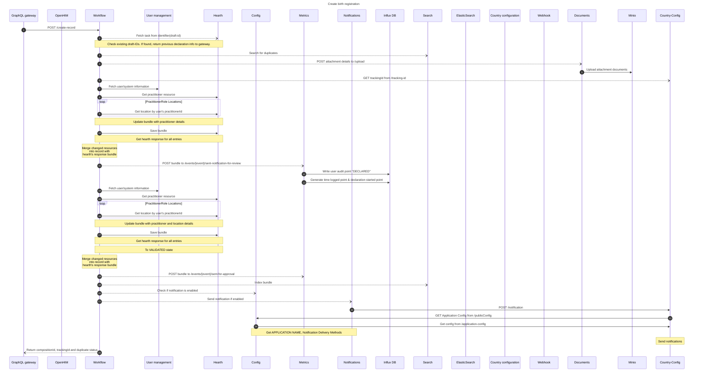

# Create birth registration (registration-agent)

```mermaid
---
title: Create birth registration
---

sequenceDiagram

    autonumber
    participant GraphQL gateway
    participant OpenHIM
    participant Workflow
    participant User management
    participant Hearth
    participant Config
    participant Metrics
    participant Notifications
    participant Influx DB
    participant Search
    participant ElasticSearch
    participant Country configuration
    participant Webhook

    GraphQL gateway->>Workflow: POST /create-record
    Workflow--)Hearth: Fetch task from identifier(draft-id)
    Note over Workflow,Hearth: Check existing draft-IDs. If found, return previous declaration info to gateway.

    Workflow--)Search: Search for duplicates

    Workflow--)Documents: POST attachment details to /upload
    Documents->>Minio: Upload attachment documents

    Workflow--)Country-Config: GET trackingId from /tracking-id

    Workflow->>User management: Fetch user/system information
    Workflow->>Hearth: Get practitioner resource

    loop PractitionerRole Locations
      Workflow->>Hearth: Get location by user's practitionerId
    end
    Note over Workflow,Hearth: Update bundle with practitioner details

    Workflow->>Hearth: Save bundle
    Note over Workflow,Hearth: Get hearth response for all entries

    Note over Workflow: Merge changed resources<br /> into record with <br /> hearth's response bundle

    Workflow--)Metrics: POST bundle to /events/{event}/sent-notification-for-review
    Metrics->>Influx DB: Write user audit point "DECLARED"
    Metrics->>Influx DB: Generate time logged point & declaration started point

    Workflow->>User management: Fetch user/system information
    Workflow->>Hearth: Get practitioner resource

    loop PractitionerRole Locations
      Workflow->>Hearth: Get location by user's practitionerId
    end
    Note over Workflow,Hearth: Update bundle with practitioner and location details

    Workflow->>Hearth: Save bundle
    Note over Workflow,Hearth: Get hearth response for all entries

    Note over Workflow,Hearth: To VALIDATED state

    Note over Workflow: Merge changed resources<br /> into record with <br /> hearth's response bundle

    Workflow--)Metrics: POST bundle to /events/{event}/sent-for-approval

    Workflow--)Search: Index bundle

    Workflow--)Config: Check if notification is enabled
    Workflow--)Notifications: Send notification if enabled

    Notifications->>Country-Config: POST /notification
    Country-Config->>Config: GET Application Config from /publicConfig
    Config->>Country-Config: Get config from /application-config
    Note over Config,Notifications: Get APPLICATION NAME, Notification Delivery Methods

    Note over Country-Config: Send notifications

    Workflow--)GraphQL gateway: Return compositionId, trackingId and duplicate status
```
