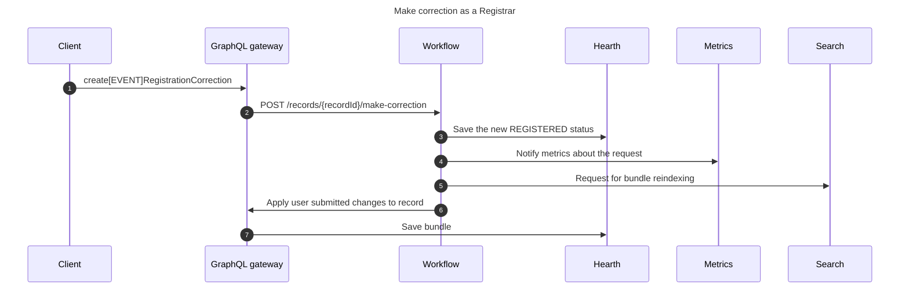

## Make correction as a registrar

```mermaid
---
title: Make correction as a Registrar
---
sequenceDiagram
    autonumber
    Client->>GraphQL gateway: create[EVENT]RegistrationCorrection
    GraphQL gateway->>Workflow: POST /records/{recordId}/make-correction
    Workflow->>Hearth: Save the new REGISTERED status
    Workflow->>Metrics: Notify metrics about the request
    Workflow->>Search: Request for bundle reindexing
    Workflow->>GraphQL gateway: Apply user submitted changes to record
    GraphQL gateway->>Hearth: Save bundle
```
