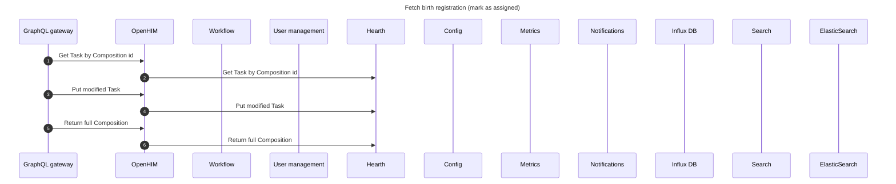

# Mark birth as assigned

```mermaid
---
title: Fetch birth registration (mark as assigned)
---

sequenceDiagram
    autonumber
    participant GraphQL gateway
    participant OpenHIM
    participant Workflow
    participant User management
    participant Hearth
    participant Config
    participant Metrics
    participant Notifications
    participant Influx DB
    participant Search
    participant ElasticSearch

    % markRecordAsDownloadedOrAssigned
      % getTaskEntry
    GraphQL gateway->>OpenHIM: Get Task by Composition id
    OpenHIM->>Hearth: Get Task by Composition id

    GraphQL gateway->>OpenHIM: Put modified Task
    OpenHIM->>Hearth: Put modified Task

    GraphQL gateway->>OpenHIM: Return full Composition
    OpenHIM->>Hearth: Return full Composition
```
