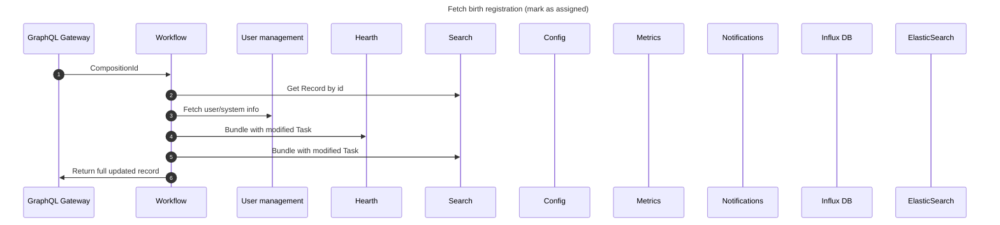

# Mark birth as assigned

```mermaid
---
title: Fetch birth registration (mark as assigned)
---

sequenceDiagram
    autonumber
    participant GraphQL Gateway
    participant Workflow
    participant User management
    participant Hearth
    participant Search
    participant Config
    participant Metrics
    participant Notifications
    participant Influx DB
    participant ElasticSearch

    % markRecordAsDownloadedOrAssigned
      % getTaskEntry
    GraphQL Gateway->>Workflow: CompositionId
    Workflow->>Search: Get Record by id

    Workflow->>User management: Fetch user/system info
    Workflow->>Hearth: Bundle with modified Task
    Workflow->>Search: Bundle with modified Task

    Workflow->>GraphQL Gateway: Return full updated record
```
