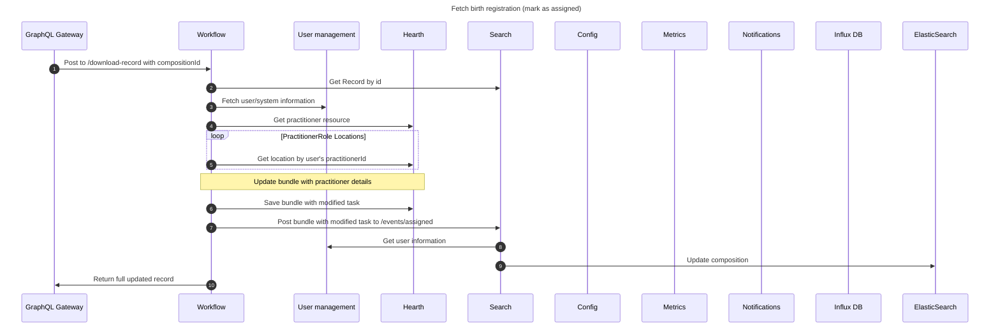

# Mark birth as assigned

```mermaid
---
title: Fetch birth registration (mark as assigned)
---

sequenceDiagram
    autonumber
    participant GraphQL Gateway
    participant Workflow
    participant User management
    participant Hearth
    participant Search
    participant Config
    participant Metrics
    participant Notifications
    participant Influx DB
    participant ElasticSearch

    % markRecordAsDownloadedOrAssigned
      % getTaskEntry
    GraphQL Gateway->>Workflow: Post to /download-record with compositionId
    Workflow->>Search: Get Record by id

    Workflow->>User management: Fetch user/system information
    Workflow->>Hearth: Get practitioner resource

    loop PractitionerRole Locations
      Workflow->>Hearth: Get location by user's practitionerId
    end
    Note over Workflow,Hearth: Update bundle with practitioner details

    Workflow->>Hearth: Save bundle with modified task
    Workflow->>Search: Post bundle with modified task to /events/assigned

    Search->>User management: Get user information
    Search->>ElasticSearch: Update composition

    Workflow->>GraphQL Gateway: Return full updated record
```
