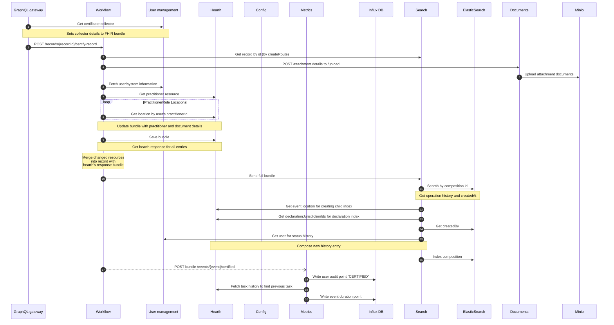

# Mark birth as certified

```mermaid
sequenceDiagram
    autonumber
    participant GraphQL gateway
    participant Workflow
    participant User management
    participant Hearth
    participant Config
    participant Metrics
    participant Influx DB
    participant Search
    participant ElasticSearch
    participant Documents
    participant Minio

    GraphQL gateway->>User management: Get certificate collector
    Note over GraphQL gateway,User management: Sets collector details to FHIR bundle

    GraphQL gateway->>Workflow: POST /records/{recordId}/certify-record
    Workflow->>Search: Get record by id (by createRoute)

    Workflow->>Documents: POST attachment details to /upload
    Documents->>Minio: Upload attachment documents

    Workflow->>User management: Fetch user/system information
    Workflow->>Hearth: Get practitioner resource

    loop PractitionerRole Locations
      Workflow->>Hearth: Get location by user's practitionerId
    end
    Note over Workflow,Hearth: Update bundle with practitioner and document details

    Workflow->>Hearth: Save bundle
    Note over Workflow,Hearth: Get hearth response for all entries

    Note over Workflow: Merge changed resources<br /> into record with <br /> hearth's response bundle

    Workflow->>Search: Send full bundle
    %% upsertEvent
    Search->>ElasticSearch: Search by composition id
    Note over Search,ElasticSearch: Get operation history and createdAt

    %% createIndexBody
      %% createChildIndex
      %% addEventLocation
    Search->>Hearth: Get event location for creating child index

    %% createDeclarationIndex
    Search->>Hearth: Get declarationJurisdictionIds for declaration index
    Search->>ElasticSearch: Get createdBy

    %% createStatusHistory
    Search->>User management: Get user for status history
    Note over Search,Hearth: Compose new history entry

    Search->>ElasticSearch: Index composition

    Workflow--)Metrics: POST bundle /events/{event}/certified

    Metrics->>Influx DB: Write user audit point "CERTIFIED"
    Metrics->>Hearth: Fetch task history to find previous task
    Metrics->>Influx DB: Write event duration point
```
