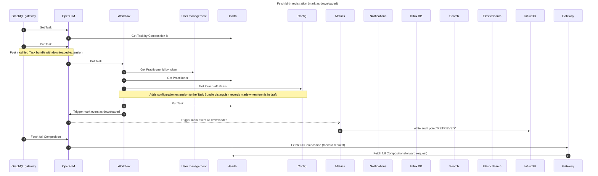

# Mark birth as downloaded

```mermaid
---
title: Fetch birth registration (mark as downloaded)
---

sequenceDiagram
    autonumber
    participant GraphQL gateway
    participant OpenHIM
    participant Workflow
    participant User management
    participant Hearth
    participant Config
    participant Metrics
    participant Notifications
    participant Influx DB
    participant Search
    participant ElasticSearch

    GraphQL gateway->>OpenHIM: Get Task
    OpenHIM->>Hearth: Get Task by Composition id

    GraphQL gateway->>OpenHIM: Put Task
    Note over GraphQL gateway,OpenHIM: Post modified Task bundle with downloaded extension

    OpenHIM->>Workflow: Put Task
    Workflow->>User management: Get Practitioner id by token
    Workflow->>Hearth: Get Practitioner

    %% NOTE HERE: if it's a System: await setupLastRegLocation(taskResource, practitioner) happens

    Workflow->>Config: Get form draft status
    Note over Workflow,Config: Adds configuration extension to the Task Bundle distinguish records made when form is in draft

    Workflow->>Hearth: Put Task
    Workflow->>OpenHIM: Trigger mark event as downloaded

    OpenHIM--)Metrics: Trigger mark event as downloaded
    Metrics->>InfluxDB: Write audit point "RETRIEVED"

    GraphQL gateway->>OpenHIM: Fetch full Composition
    OpenHIM->>Gateway: Fetch full Composition (forward request)
    Gateway->>Hearth: Fetch full Composition (forward request)
```
