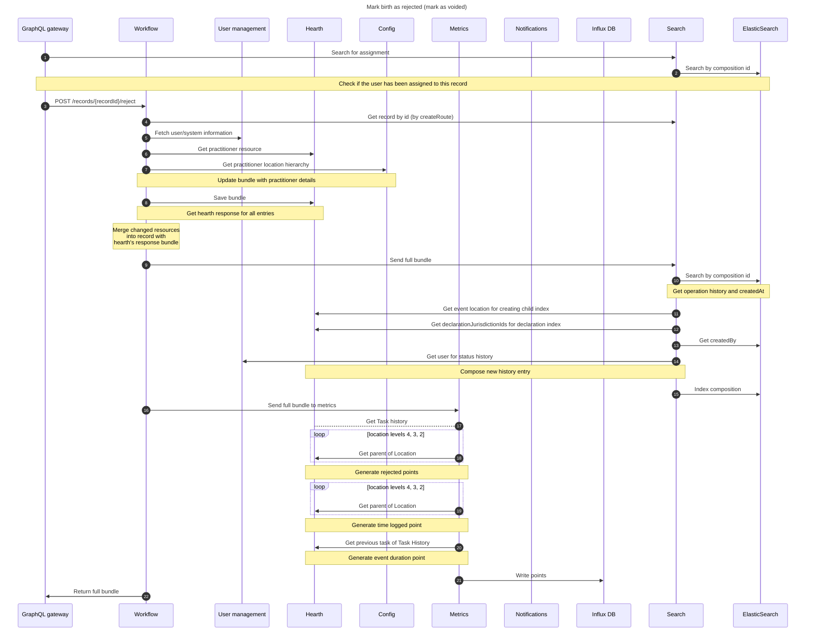

# Mark birth as void

```mermaid
---
title: Mark birth as rejected (mark as voided)
---

sequenceDiagram
    autonumber
    participant GraphQL gateway
    participant Workflow
    participant User management
    participant Hearth
    participant Config
    participant Metrics
    participant Notifications
    participant Influx DB
    participant Search
    participant ElasticSearch

    GraphQL gateway->>Search: Search for assignment
    Search->>ElasticSearch: Search by composition id
    Note over GraphQL gateway,ElasticSearch: Check if the user has been assigned to this record

    GraphQL gateway->>Workflow: POST /records/{recordId}/reject
    Workflow->>Search: Get record by id (by createRoute)

    Workflow->>User management: Fetch user/system information
    Workflow->>Hearth: Get practitioner resource
    Workflow->>Config: Get practitioner location hierarchy
    Note over Workflow,Config: Update bundle with practitioner details

    Workflow->>Hearth: Save bundle
    Note over Workflow,Hearth: Get hearth response for all entries

    Note over Workflow: Merge changed resources<br /> into record with <br /> hearth's response bundle

    Workflow->>Search: Send full bundle
    %% upsertEvent
    Search->>ElasticSearch: Search by composition id
    Note over Search,ElasticSearch: Get operation history and createdAt

    %% createIndexBody
      %% createChildIndex
      %% addEventLocation
    Search->>Hearth: Get event location for creating child index

    %% createDeclarationIndex
    Search->>Hearth: Get declarationJurisdictionIds for declaration index
    Search->>ElasticSearch: Get createdBy

    %% createStatusHistory
    Search->>User management: Get user for status history
    Note over Search,Hearth: Compose new history entry

    Search->>ElasticSearch: Index composition

    Workflow->>Metrics: Send full bundle to metrics
    Metrics-->Hearth: Get Task history

    loop location levels 4, 3, 2
        Metrics->>Hearth: Get parent of Location
    end
    Note over Metrics,Hearth: Generate rejected points

    loop location levels 4, 3, 2
        Metrics->>Hearth: Get parent of Location
    end
    Note over Metrics,Hearth: Generate time logged point

    Metrics->>Hearth: Get previous task of Task History
    Note over Metrics,Hearth: Generate event duration point
    Metrics->>Influx DB: Write points

    Workflow->>GraphQL gateway: Return full bundle
```
