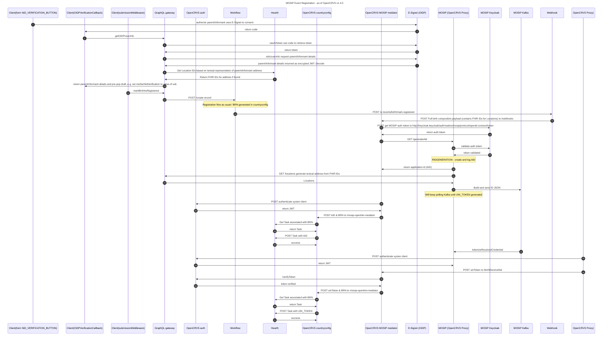

## MOSIP Birth Registration - as of OpenCRVS v1.4.0

## OpenCRVS MOSIP mediator - NodeJS - Hosted at OpenCRVS: https://github.com/opencrvs/mosip-mediator

## MOSIP (OpenCRVS Proxy) - Java - Hosted at MOSIP: https://github.com/mosip/mosip-opencrvs

## OpenCRVS countryconfig: https://github.com/opencrvs/opencrvs-mosip

## ENV VARS used in countryconfig:

## MOSIP_MEDIATOR_BIRTH_PROXY_CALLBACK_URL: https://api.collab.mosip.net/opencrvs/v1/birth

## MOSIP_MEDIATOR_GENERATE_AID_URL: https://api.collab.mosip.net/opencrvs/v1/generateAid

## NATIONAL_ID_OIDP_TOKEN_URL: https://esignet.collab.mosip.net/v1/esignet/oauth/v2/token

## NATIONAL_ID_OIDP_USERINFO_URL: https://esignet.collab.mosip.net/v1/esignet/oidc/userinfo
