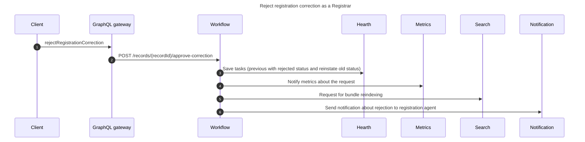

## Request rejection flow

```mermaid
---
title: Reject registration correction as a Registrar
---
sequenceDiagram
    autonumber
    Client->>GraphQL gateway: rejectRegistrationCorrection
    GraphQL gateway->>Workflow: POST /records/{recordId}/approve-correction
    Workflow->>Hearth: Save tasks (previous with rejected status and reinstate old status)
    Workflow->>Metrics: Notify metrics about the request
    Workflow->>Search: Request for bundle reindexing
    Workflow->>Notification: Send notification about rejection to registration agent
```
