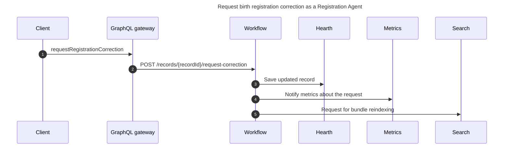

# Request birth registration correction as a Registration Agent

```mermaid
---
title: Request birth registration correction as a Registration Agent
---

sequenceDiagram
    autonumber
    participant Client
    participant GraphQL gateway
    participant Workflow
    participant Hearth
    participant Metrics


    Client->>GraphQL gateway: requestRegistrationCorrection
    GraphQL gateway->>Workflow: POST /records/{recordId}/request-correction
    Workflow->>Hearth: Save updated record
    Workflow->>Metrics: Notify metrics about the request
    Workflow->>Search: Request for bundle reindexing
```
